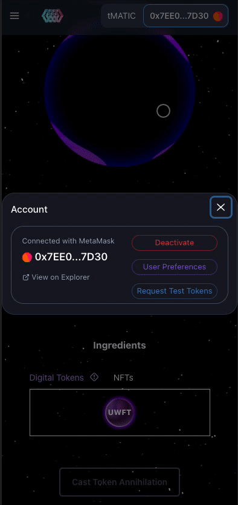
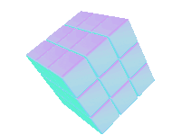

# General FAQ

## My Tokens Or NFTs are not showing up. 

Sometimes Unwanted's automatic blockchain refresh misses new tokens that were recently added to your wallet. To force a refresh try visiting **User Preferences** and hitting **Refresh Account.**&#x20;

********

## The Images for my NFTS dont show up.

NFT indexing is a slow and tedious process. The Unwanted application continuously checks your NFTs for metadata that holds a reference to your NFT's image. If an image is found, Unwanted will try to fetch the image from IPFS or from the hoster of the image. If an image cannot be loaded a NO METADATA cube will show.\

The best way to force NFT images to refresh is by visiting **User Preferences** and hitting **Refresh Account.**&#x20;

