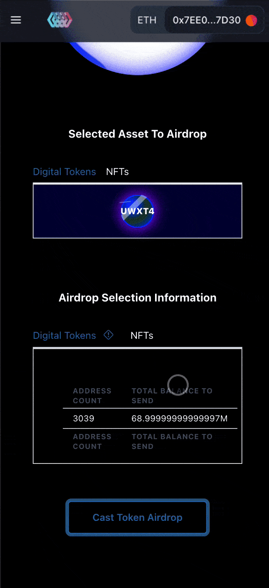

# How To Airdrop

To airdrop to externally owned accounts, you will need to upload a CSV file with the addresses of the accounts you want to send tokens or NFTs to as well as the balances or token ids of the token or NFT you want to airdrop. Visit the Airdropper to get started.


MAKE SURE THAT YOU ONLY CONNECT TO THE OFFICIAL UNWANTED APPLICATION TO PREVENT PHISHING SCAMS!


### Page View:

Desktop:

Mobile:

### Select A Token Or NFT

Begin the airdrop process by first selecting a token or NFT to airdrop.

Use the tab selector to select either an NFT or Token to airdrop.

Below will be either Tokens or NFTs:

Tokens:

.png>)

NFTs:

Click on an asset and it will bring up a modal asking you to add the asset to the queue.

.png>)

Click on `Add Token` (or NFT) and the asset will be added to the queue.

After adding the asset, the selection container will switch to a container with a button to upload a CSV.

### CSV Uploader

The CSV uploader will accept CSV files that contain data that fits the upload acceptance criteria.

#### Token Airdrop Criteria:

The CSV to upload may look similar to:

| HolderAddress\* | Balance\*\*\* |
| --------------- | ------------- |
| 0x123           | 12390         |
| 0x456           | 1.213         |
| 0x789           | 0.004         |
| 0x012           | 1E-12         |
| 0x888           | 120.3323      |

#### NFT Airdrop Criteria

| HolderAddress\* | TokenId\*\* |
| --------------- | ----------- |
| 0x892           | 23          |
| 0x991           | 1           |
| 0x321           | 482         |


Please include the full Address\*

NFT Token Ids cannot be non-existing\*\*

Token Balances must be positive\*\*\*


Upload the CSV file and allow the application to load the data. The app will display the total balance to send as well as the total amount of addresses.\
\

### Prepare & Initiate

Doing so will enable the `Cast Token Airdrop` button at the bottom allowing you to view the list of batches that are prepared to be sent.

You will have to approve the Airdropper to transfer to the addresses on your behalf. This will allow the Airdropper to be able to transfer the total balance based on the amounts of balances parsed from the CSV.

After approval, you may begin initiating the batch transfers by clicking on `Initiate Airdrop` each batch. This will initiate a transaction that will send the inputted balances of up to 200 addresses in a single transaction.&#x20;

Ex. Tx on the Kovan ETH Network: [https://kovan.etherscan.io/tx/0x278a64443215dd296f4105f819f5e1bb84cb609c4637a18df24a6c4bcddc58f8](https://kovan.etherscan.io/tx/0x278a64443215dd296f4105f819f5e1bb84cb609c4637a18df24a6c4bcddc58f8)
